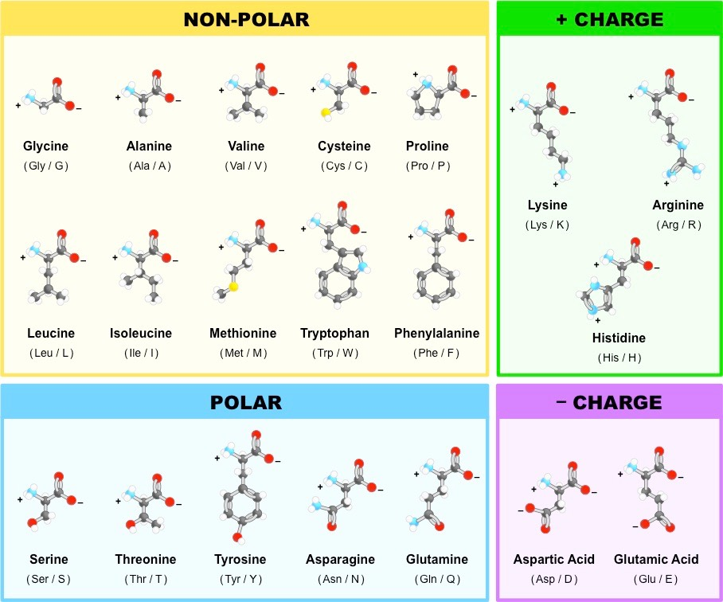

aminoacid
=========

.. toctree::
   :maxdepth: 4

information
-----------

.. automodule:: aminoacid
    :members:
    :undoc-members:

* **Residue_name:** line[17:20] from pdb file. You obtain the aminoacid name of three letters.
* **Residue_sequence_number:** line[22:26] from pdb file. You obtain a number.
