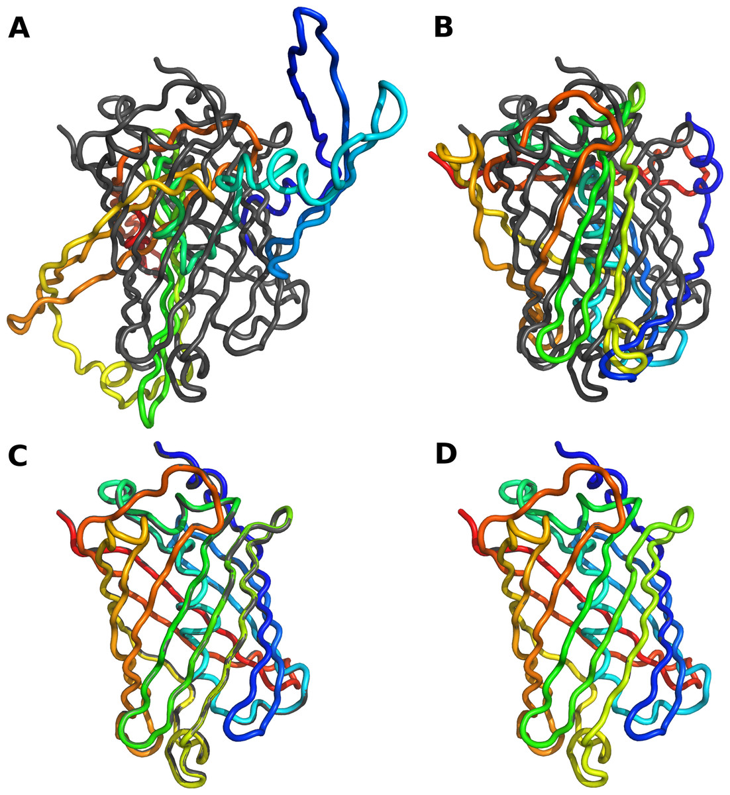

model
=====

.. toctree::
   :maxdepth: 4

information
-----------

.. automodule:: model
    :members:
    :undoc-members:

* **model_identifier:** Each model is represented by a number starting at 1. Is a string and in mongo is inserted as MODEL + model_identifier.
